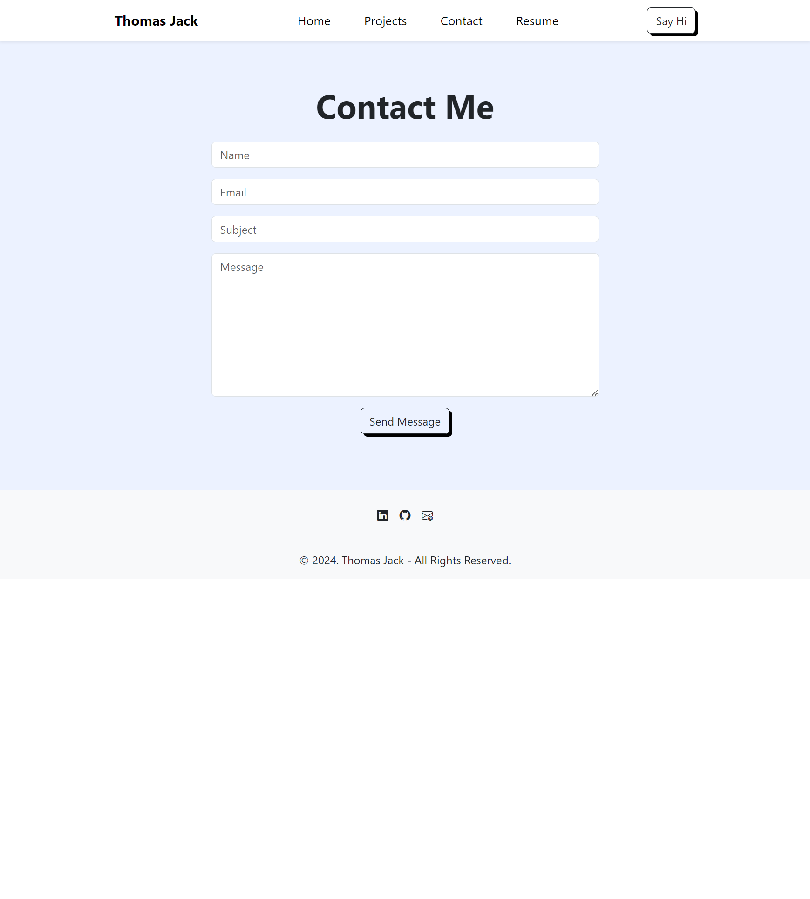

# TJ-React-Portfolio

## [Table of Contents](#table-of-contents)

* [Description](#description)
* [Acceptance Criteria](#acceptance-criteria)
* [Required-Components](#required-component)
* [Required Component Content](#required-component-content)
* [Mock-Up](#mock-up)
* [Installation](#installation)
* [Credits](#credits)
* [License](#license)
* [Badges](#badges)
* [Features](#features)
* [Contributing](#contributing)
* [Tests](#tests)

## [Description](#description)
The task was to create a portfolio using react, react bootstrap, routes and Links to all projects

## [Acceptance Criteria](#acceptance-criteria)
* Technologies that must be used:
  * React
  * Navigation with `React Router`, dynamic rendering, or another third part router
* Your portfolio **must contain** the following information:
  * Your name
  * Links to your:
    * GitHub Profile
    * LinkedIn Page
    * Email Address
    * Phone Number - (optional)
    * PDF version of your resume
      * Your resume **must** contain up-to-date projects and professional experience
    * A list of projects (Challenges or Projects). For each project, make sure you have the following:
      * Project title
      * Link to the deployed version
      * Link to the GitHub repository
      * GIF or screenshot of the deployed application

### Required Components

* At a minium, your portfolio must render these 5 components:
  1. App
  2. Header
  4. Home
  5. Project Gallery
  6. Contact

### Required Component Content

* App:
  * Must be your top level component and render all necessary children components
* Header:
  * Must be rendered across the entire site
  * Must Contain a Navbar
* Project Gallery:
  * Must render dynamically 6 instances of the Project component
    * Be sure to store your project data in a JSON file and import it into your project
* Project:
  * Must be a reusable component that ingests JSON data as a props and renders a single instance for each project.
  * Must utilize router props to properly render the right project based on user selection
  * Must render the following info:
    * Project title
    * Link to the deployed version
    * Link to the GitHub repository
    * GIF or screenshot of the deployed application
* Contact:
  * Must have contact information
  * Have a contact form for handling events
* Home:
* This should be a welcome landing page that contains:
* Your Name
* A Headshot of you
* Your brand statement
* Some indication that this is your portfolio site

## [Mock-Up](#mock-up)
[`App Demo`] 

 
 
 
[`Page images`]
 

[`Project Repo`](https://github.com/quikstart86/TJ-React-Portfolio)

[`Deployed App`](https://tj-react-portfolio.netlify.app/)

## [Installation](#installation)

* Created the app with Vite , which includes React, Babel, ESL. Added dependecies including:   "dependencies":
    "bootstrap": "^5.3.2",
    "bootstrap-icons": "^1.11.3",
    "localforage": "^1.10.0",
    "match-sorter": "^6.3.4",
    "react": "^18.2.0",
    "react-dom": "^18.2.0",
    "react-router-dom": "^6.22.0",
    "router": "^1.3.8",
    "sort-by": "^1.2.0"

    And uploaded and hosted using `*Netlify*`("https://www.netlify.com)

## [Credits](#credits)

Built completely by `Thomas Jack`

 

**Support and mentoring from course mentors:**
 
[Meg Meyers](https://github.com/femke77)

**Peer Study Group Support:**
N/A

**Supporting links:**  
N/A

## [License](#license)

MIT License

Copyright (c) <2023> <Home-App>

Permission is hereby granted, free of charge, to any person obtaining a copy
of this software and associated documentation files (the "Software"), to deal
in the Software without restriction, including without limitation the rights
to use, copy, modify, merge, publish, distribute, sublicense, and/or sell
copies of the Software, and to permit persons to whom the Software is
furnished to do so, subject to the following conditions:

The above copyright notice and this permission notice shall be included in all
copies or substantial portions of the Software.

THE SOFTWARE IS PROVIDED "AS IS", WITHOUT WARRANTY OF ANY KIND, EXPRESS OR IMPLIED, INCLUDING BUT NOT LIMITED TO THE WARRANTIES OF MERCHANTABILITY, FITNESS FOR A PARTICULAR PURPOSE AND NONINFRINGEMENT. IN NO EVENT SHALL THE AUTHORS OR COPYRIGHT HOLDERS BE LIABLE FOR ANY CLAIM, DAMAGES OR OTHER LIABILITY, WHETHER IN AN ACTION OF CONTRACT, TORT OR OTHERWISE, ARISING FROM, OUT OF OR IN CONNECTION WITH THE SOFTWARE OR THE USE OR OTHER DEALINGS IN THE SOFTWARE.

## [Badges](#badges)

## [Features](#features)

N/A

## [Contributing](#contributing)
N/A

## [Tests](#tests)

Tested application for responsiveness/ loading/ email handling/ links and images

 

[Back to top](#top)